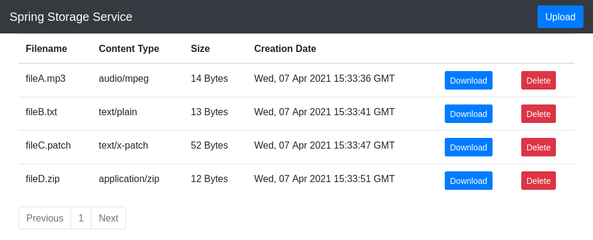

# Spring Storage Service

This demo shows a working example of a storage service implemented with SpringBoot technologies.

The uploaded files get stored in the file system whereas all metadata get stored in a database.

The code was written with 'Clean Architecture' in mind.

The project includes Unit tests. And there is also an Integration test implemented with REST-assured.

## Run App

```
$ ./gradlew bootRun
```

## Frontend

The Demo Frontend can be accessed at http://localhost:8080.


## Users

| Username | Password |
|----------|----------|
| alice    | secret   |
| bob      | secret   |
